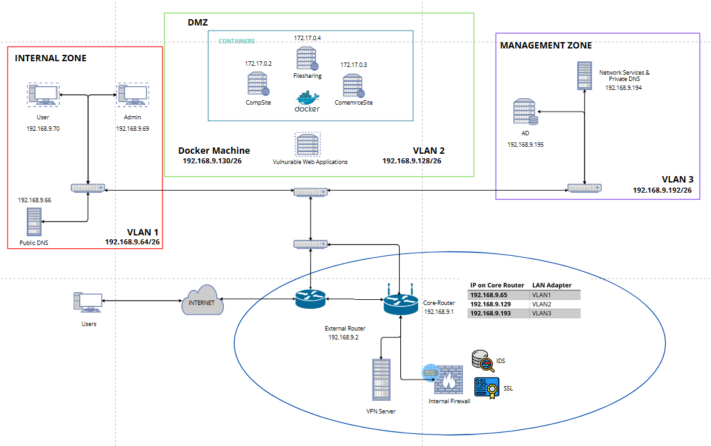

## Plan

### Designing Security Architecture
[Link to Plan_DesignSecurityArchitecture.pdf](./Plan_DesignSecurityArchitecture.pdf)

### Project Conceptualization & Relevant Services
[Link to Plan_ProjectConceptualization.pdf](./Plan_ProjectConceptualization.pdf)

## Final Assessment

### Cybersecurity Assessment Summary
[Link to CybersecurityAssesmentSummary.pdf](./CybersecurityAssesmentSummary.pdf)

### Final Network Digram 

### Functional Testing - Low-Level Design
[Link to FunctionalTesting-Low-Level-Design.pdf](./FunctionalTesting-Low-Level-Design.pdf)

### TVRA Capstone - Final Report based off NIST
[Link to Group8_TVRA_FinalProject.xlsx](./Group8_TVRA_FinalProject.xlsx)

